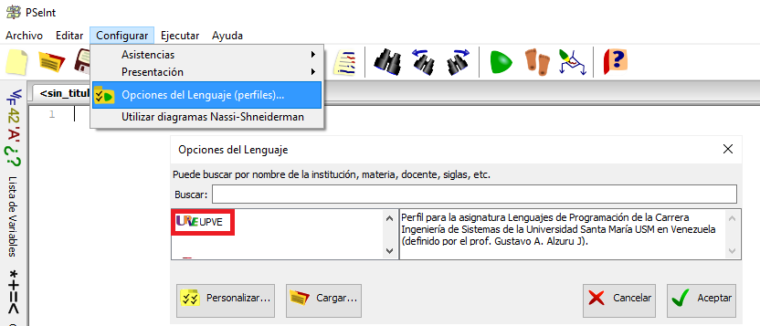

# Teoria

## UF01 - Programació estructurada

[Introducció (pdf)](https://drive.google.com/file/d/1HcVw_7iNHt14V5Z4IVsTG74uw3BAZJvE/view)

[Programació Estructurada (pdf)](https://drive.google.com/file/d/17miMWSALxTOQ7WVUMR_8nj33GWCmKcq6/view)

## Configuració psint, enunciats i les seves solucions

[Enunciats de pseudocodi](https://docs.google.com/document/d/1vxIv4B1M4ZkPUT8Gd9LdST90HbH9Ogcqbq0eA_tVR1w/view)

[Carpeta amb les solucions als enunciats](https://drive.google.com/drive/folders/1cJfeRTOa6o4RABzJuwijKmDx4jLB0h82)

[Getting Started with Java in VS Code](https://code.visualstudio.com/docs/java/java-tutorial)

[Enunciats, activitats i exercicis amb JAVA](https://docs.google.com/document/d/16LS34amjFw8euDG_pULGB0pzCmT_zRGDVfr8QhrSUas)

## Teoria: Excepcions de Java - Try...Catch

[Excepcions de Java - Try...Catch](https://docs.google.com/document/d/1fKWVEAKtMN9EmtzbMxcJpH74fX0GwpKhYuKxrfW_Zs8)

## Fitxers de teoria

[A_Teoria_02_equals_boolean.java](src/A_Teoria_02_equals_boolean.java)

[A_Teoria_03_Bucles.java](src/A_Teoria_03_Bucles.java)

[A_Teoria_04_Arrays.java](src/A_Teoria_04_Arrays.java)

[A_Teoria_05_Funcions.java](src/A_Teoria_05_Funcions.java)

[A_Teoria_06A_TryCatch.java](src/A_Teoria_06A_TryCatch.java)

[A_Teoria_06B_TryCatch.java](src/A_Teoria_06B_TryCatch.java)

[A_Teoria_07A_FitxersLlegir.java](src/A_Teoria_07A_FitxersLlegir.java)

[A_Teoria_07B_FitxersEscriure.java](src/A_Teoria_07B_FitxersEscriure.java)

[Exercicis Java per Nivells](https://docs.google.com/document/d/1jrEgevVfXIIybcjheUReFnLYNjH4vTWk6PeSKc6OMvk)

## Enuncitats Java curs 2021-2022

Aquí podeu trobar tots els programes que solucionen els diferents enunciats que anem proposant durant el curs.

[Enu01_Hipotenusa.java](src/Enu01_Hipotenusa.java)

[Enu02_MostraNomEdat.java](src/Enu02_MostraNomEdat.java)

[Enu03_ConsumCotxe.java](src/Enu03_ConsumCotxe.java)

[Enu04_InteresBancari.java](src/Enu04_InteresBancari.java)

[Enu05_ResultatsDosNombres.java](src/Enu05_ResultatsDosNombres.java)

[Enu06_nomDiaSetmana.java](src/Enu06_nomDiaSetmana.java)

[Enu07_nomMes.java](src/Enu07_nomMes.java)

[Enu08_missatgeTemperatura.java](src/Enu08_missatgeTemperatura.java)

[Enu08_missatgeTemperatura_OPTIM.java](src/Enu08_missatgeTemperatura_OPTIM.java)

[Enu10_Sumatori.java](src/Enu10_Sumatori.java)

[Enu11_For_0_100.java](src/Enu11_For_0_100.java)

[Enu12_For_Senars_100_0.java](src/Enu12_For_Senars_100_0.java)

[Enu13_Senars_1000_2000_senseFOR.java](src/Enu13_Senars_1000_2000_senseFOR.java)

[Enu14_Senars_1000_2000_ambFOR.java](src/Enu14_Senars_1000_2000_ambFOR.java)

[Enu15_potencia.java](src/Enu15_potencia.java)

[Enu16_AEsDivisorDeB.java](src/Enu16_AEsDivisorDeB.java)

[Enu17_empresaFulmigacio_versio2.java](src/Enu17_empresaFulmigacio_versio2.java)

[Enu17_FulmigacioVersio3.java](src/Enu17_FulmigacioVersio3.java)

[Enu18_controlFesta.java](src/Enu18_controlFesta.java)

[Enu18_controlFestaAmbTry.java](src/Enu18_controlFestaAmbTry.java)

[Enu19_AnyDeTraspas.java](src/Enu19_AnyDeTraspas.java)

[Enu20_EndivinarAleatori.java](src/Enu20_EndivinarAleatori.java)

[Enu21_ArraySenarsArrayParells.java](src/Enu21_ArraySenarsArrayParells.java)

[Enu22_ArrayPotenciesDe2.java](src/Enu22_ArrayPotenciesDe2.java)

[Enu23_ArrayParulesIMides.java](src/Enu23_ArrayParulesIMides.java)

[Enu23_ArrayParulesIMidesVersio2.java](src/Enu23_ArrayParulesIMidesVersio2.java)

[Enu24_ArrayComptaParules.java](src/Enu24_ArrayComptaParules.java)

[Enu25_ArrayComptaVocals.java](src/Enu25_ArrayComptaVocals.java)

[Enu26_OrdenaArrayEnters.java](src/Enu26_OrdenaArrayEnters.java)

[Enu26_OrdenaArrayStrings.java](src/Enu26_OrdenaArrayStrings.java)

[Enu27_CanviaSIMesGran.java](src/Enu27_CanviaSIMesGran.java)

[Enu28_ArrayValorsPrimers.java](src/Enu28_ArrayValorsPrimers.java)

[Enu29_DesplassaIndex.java](src/Enu29_DesplassaIndex.java)

[Enu30_DesplassaNPosicions.java](src/Enu30_DesplassaNPosicions.java)

[Enu32_MaximaDiferenciaEntreConsecitius.java](src/Enu32_MaximaDiferenciaEntreConsecitius.java)

[Enu33_MaximaDiferenciaEntreTots.java](src/Enu33_MaximaDiferenciaEntreTots.java)

[Enu34_BarrejaArraysOrdenats.java](src/Enu34_BarrejaArraysOrdenats.java)

[Enu35_DosArraysIguals.java](src/Enu35_DosArraysIguals.java)

[Enu37_MaximValorMatriu.java](src/Enu37_MaximValorMatriu.java)

[Enu38_MatriuTrasposta.java](src/Enu38_MatriuTrasposta.java)

[Enu39_MatriuIdentitat.java](src/Enu39_MatriuIdentitat.java)

[Enu40_MatriuIdentitatPrincipalOSecundaria.java](src/Enu40_MatriuIdentitatPrincipalOSecundaria.java)

[Enu41_SumaDeMatrius.java](src/Enu41_SumaDeMatrius.java)

[Enu44_LoteriaPrimitiva.java](src/Enu44_LoteriaPrimitiva.java)

[Enu45_Calculadora.java](src/Enu45_Calculadora.java)

[EnuFulmigacio_2.java](src/EnuFulmigacio_2.java)

[Exercici13.java](src/Exercici13.java)

[ProgramaCanvi.java](src/ProgramaCanvi.java)

[SousTreballadors.java](src/SousTreballadors.java)

[Enunciats per activitats amb funcions](https://docs.google.com/document/d/1efSk_S5um29Q6cViD8-kewi9vGVp7rSxSlKjn3STN5k)

[Creació d'una Classe per poder reaprofitar codi.](https://sites.google.com/ginebro.cat/apunts/daw/daw-mp03/MP03-UF02-disseny-modular)

[Reptes: Array](https://docs.google.com/document/d/1Q-85udw8y-4Nxx2IlbDT1nN3RM1SSWRhd_U-TRIdOaw)

## Examen_20211106

[Examen_20211106_En_01.java](src/Examen_20211106_En_01.java)

[Examen_20211106_En_02.java](src/Examen_20211106_En_02.java)

[Examen_20211106_En_03.java](src/Examen_20211106_En_03.java)

[Examen_20211106_En_04.java](src/Examen_20211106_En_04.java)

## Examen_20211123

[Examen_20211123_En_01.java](src/Examen_20211123_En_01.java)

[Examen_20211123_En_02.java](src/Examen_20211123_En_02.java)

[Examen_20211123_En_Teo_01.java](src/Examen_20211123_En_Teo_01.java)

[Examen_20211123_En_Teo_01_2.java](src/Examen_20211123_En_Teo_01_2.java)

[Examen_20211123_En_Teo_7_joan.java](src/Examen_20211123_En_Teo_7_joan.java)

[Examen_20211123_En_Teo_8_joan.java](src/Examen_20211123_En_Teo_8_joan.java)

[Examen_20211123_En_Teo_xx.java](src/Examen_20211123_En_Teo_xx.java)

## Examen_20211220

[Examen_20211220_MatIArr_activitat1.java](src/Examen_20211220_MatIArr_activitat1.java)

[Examen_20211220_MatIArr_activitat2.java](src/Examen_20211220_MatIArr_activitat2.java)

[Examen_20211220_MatIArr_activitat3.java](src/Examen_20211220_MatIArr_activitat3.java)

[Examen_20211220_MatIArr_activitat4.java](src/Examen_20211220_MatIArr_activitat4.java)

[Examen_20211220_MatIArr_activitat5.java](src/Examen_20211220_MatIArr_activitat5.java)

[01_Activitats_Programacio_Fitxers_](https://docs.google.com/document/d/1JDE_JIImSBufaYgvVi1euy4cPjMMgT9GsFUTMx9e5c0/edit?usp=sharing)

## Fitxers

[FitEnu01SumaCSV.java](src/Fitxers/FitEnu01SumaCSV.java)

[Fitxers.java](src/Fitxers/Fitxers.java)

[_fitEnt_Enu01.txt](src/Fitxers/_fitEnt_Enu01.txt)

[_fitSor_Enu01.txt](src/Fitxers/_fitSor_Enu01.txt)

[MatriuPlenaUnitats.java](src/MatriuPlenaUnitats.java)

[MatriuPlenaUnitats2.java](src/MatriuPlenaUnitats2.java)

## PardoJoanFuncions

[Aplicacio.java](src/PardoJoanFuncions/Aplicacio.java)

[Jpc.java](src/PardoJoanFuncions/Jpc.java)

